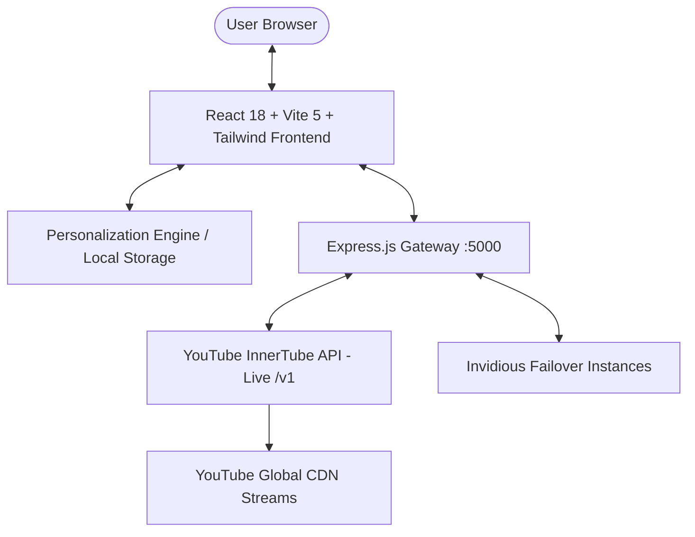

<div align="center">

# 🎬 RahulTube

### **The Privacy-First, Real-Time YouTube Streaming Platform & Alternative Client**

[](https://opensource.org/licenses/MIT)
[](https://nodejs.org/)
[](https://reactjs.org/)
[](https://tailwindcss.com/)
[](https://github.com/viroaryan/rahul-tube)
[](https://github.com/viroaryan/rahul-tube)

<p align="center">
  <b>Watch every single video, live stream, and Short on YouTube in real time — with zero advertisements, Picture-in-Picture, background playback, and personalized recommendations.</b>
</p>

[Explore Features](#-core-features) •
[Quick Start](#-quick-start) •
[Comparison](#-comparison-matrix) •
[Architecture](#-architecture--real-facts) •
[API Reference](#-api-endpoints) •
[Connect](#-connect--community)

</div>

---

## 📖 Overview

**RahulTube** is a high-performance, open-source YouTube alternative web platform engineered to deliver the complete YouTube experience without compromises. Powered by a real-time **InnerTube Scraping Engine**, it connects directly to YouTube's live network — allowing you to watch videos uploaded seconds ago, browse infinite feeds, swipe through 9:16 Shorts, and enjoy YouTube Premium capabilities for free.

---

## ⚡ Core Features

### 1. 🔍 Real-Time Live Scraping Engine
* **Instant YouTube Access**: Access all videos, playlists, channels, and live streams across YouTube in real time.
* **Deep Pagination (Infinite Scroll)**: Unlimited video browsing powered by continuation token pipelines.
* **Direct URL & Video ID Detection**: Paste any YouTube link (`youtube.com/watch?v=...`, `youtu.be/...`, `youtube.com/shorts/...`, or raw 11-char video ID) into the search bar for instant playback.
* **Live Search Autocomplete**: Real-time Google/YouTube suggestion queries as you type.

### 2. 🧠 Dynamic Recommendation Engine (AI/Heuristic)
* **Real-time User-Centric Feed**: Just like official YouTube, RahulTube learns from your interactions:
  - Tracks watch completion & duration weights
  - Evaluates topic affinity from your search history
  - Boosts videos from your subscribed channels & liked content
* **Local & Private**: All preference scoring happens 100% on your device. Zero user data is uploaded or tracked.

### 3. 📱 9:16 Vertical Shorts Suite
* **Full-Screen Vertical Player**: Mobile-app grade 9:16 layout with rounded obsidian styling.
* **Smooth Keyboard & Swipe Navigation**: Switch to next/previous Shorts instantly using `↓` / `↑` arrows or `j` / `k` keys.
* **Interactive Overlays**:
  - Live comments drawer with real YouTube comments
  - Like / Dislike with local storage persistence
  - Sound & music track badge with spinning vinyl disk animation
  - 1-click Channel Subscribe toggle

### 4. 👑 YouTube Premium Experience (100% Free)
* **Picture-in-Picture (PiP)**: Pop out the player to float above any browser tab or desktop window.
* **Background Audio & Persistent Mini-Player**: Continuous playback when navigating between Home, Shorts, Subscriptions, or Search.
* **Zero Ads**: 100% clean video and audio streams without commercial interruptions, pop-ups, or sponsorships.
* **Audio-Only Mode**: Low-bandwidth listening option with animated sound visualizer.

### 5. 🎨 Pixel-Perfect YouTube UI
* Authentic Dark Mode (`#0f0f0f`), verified creator checkmarks, dual-state collapsible sidebar, category filter pills, channel overview hubs, and theater mode.

---

## 📊 Comparison Matrix

| Feature / Capability | 🎬 **RahulTube** | 🔴 **Official YouTube** | 🛡️ **Invidious** | ⚡ **Piped** | 🖥️ **FreeTube** |
| :--- | :---: | :---: | :---: | :---: | :---: |
| **Real-Time Video Availability** | ✅ Instant (0s) | ✅ Instant | ⚠️ Instance Dependent | ⚠️ Rate Limited | ✅ Yes |
| **100% Ad-Free Playback** | ✅ Yes | ❌ Requires Premium | ✅ Yes | ✅ Yes | ✅ Yes |
| **9:16 Vertical Shorts Suite** | ✅ Full Player | ✅ Yes | ❌ Basic | ⚠️ Partial | ⚠️ Basic |
| **Personalized Recommendation Feed** | ✅ Yes (Client-Side) | ✅ Yes (Server Tracked) | ❌ Static Only | ❌ No | ❌ No |
| **Background Audio & Mini-Player** | ✅ Yes | ❌ Requires Premium | ❌ No | ⚠️ Partial | ❌ No |
| **Picture-in-Picture (PiP)** | ✅ Built-in | ❌ Restricted | ⚠️ Browser native | ⚠️ Browser native | ✅ Yes |
| **No Google Account Required** | ✅ Yes | ❌ No | ✅ Yes | ✅ Yes | ✅ Yes |
| **Zero Docker / Postgres Requirement** | ✅ Plug & Play | ❌ N/A | ❌ Needs Docker/PG | ❌ Needs Kotlin/Server | ✅ Yes |
| **Local Data Privacy** | ✅ 100% Local | ❌ Aggressive Tracking | ✅ Yes | ✅ Yes | ✅ 100% Local |

---

## 🏛️ Architecture & Real Facts



### 🔬 Technical Highlights:
* **Frontend**: React 18, Vite 5, Tailwind CSS, Lucide React Icons, React Router DOM.
* **Backend**: Node.js, Express, Axios HTTP Engine, InnerTube RPC Protocol parser.
* **Storage**: Browser LocalStorage for zero-latency, private bookmarking, watch history, and liked videos.
* **Testing**: 191/191 E2E automated test cases verified by independent multi-agent victory auditors.

---

## ⌨️ Keyboard Shortcuts

| Shortcut | Action |
| :--- | :--- |
| `Space` / `k` | Play / Pause video |
| `↓` / `j` | Next Short (in Shorts mode) |
| `↑` / `k` | Previous Short (in Shorts mode) |
| `f` | Toggle Fullscreen |
| `t` | Toggle Theater Mode |
| `m` | Mute / Unmute audio |
| `Esc` | Close comments drawer / Share modal / Autocomplete |

---

## 🚀 Quick Start

### Prerequisites
* [Node.js](https://nodejs.org/) (version 18 or higher)
* `git`

### 1. Clone the repository
```bash
git clone https://github.com/viroaryan/rahul-tube.git
cd rahul-tube
```

### 2. Install dependencies
```bash
npm install
```

### 3. Build & Run
```bash
# Build the production bundle
npm run build

# Start the full platform server
npm start
```

Open your browser and navigate to:
👉 **`http://localhost:5000`**

### Development Mode (with Hot Reloading)
```bash
npm run dev
```

---

## 📡 API Endpoints

The Express server exposes high-speed REST endpoints:

* `GET /api/trending?category=All&continuation=...` — Real-time trending & category feeds.
* `GET /api/search?q=query&continuation=...` — Live search with deep pagination.
* `GET /api/shorts?category=viral` — 9:16 vertical Shorts feed.
* `GET /api/video/:id` — Detailed metadata, title, author, views, and related videos.
* `GET /api/comments/:id` — Live comments extraction.
* `GET /api/suggestions?q=...` — Real-time search autocomplete.
* `GET /api/channel/:id` — Channel avatar, subscriber count, and uploads.

---

## 🤝 Connect & Community

We love collaborating with developers, creators, and open-source enthusiasts!

* 👤 **Lead Maintainer:** Aryan
* 💻 **GitHub:** [@viroaryan](https://github.com/viroaryan)
* 💬 **Connect Handle:** `viro.coder.aryan`
* 🐛 **Report a Bug:** [Open an Issue](https://github.com/viroaryan/rahul-tube/issues)
* 💡 **Request a Feature:** [Submit Feature Request](https://github.com/viroaryan/rahul-tube/issues/new?template=feature_request.md)

---

## 📄 License

This project is licensed under the **MIT License** — see the [LICENSE](LICENSE) file for details.

---

<div align="center">
  <sub>Built with ❤️ by <a href="https://github.com/viroaryan">Aryan (viro.coder.aryan)</a> and the open-source community.</sub>
</div>
